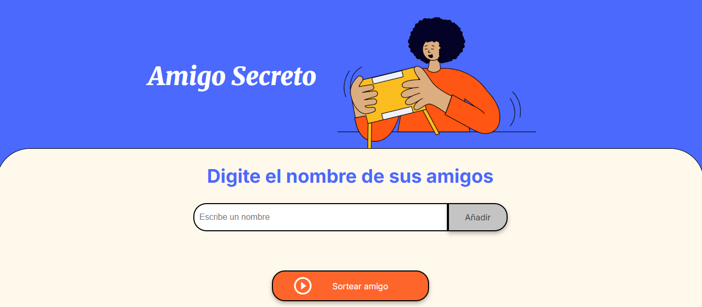

# Challenge: Amigo Secreto 🎁

Este proyecto fue desarrollado como parte del curso de **Alura Latam**, en el marco del programa ONE. La aplicación simula un sorteo de *amigo secreto*, permitiendo ingresar nombres de participantes y generando aleatoriamente las parejas.

## 🖥️ Descripción

La aplicación permite:

- Agregar nombres de participantes.
- Mostrar una lista de los participantes añadidos.
- Sortear de forma aleatoria quién regala a quién.
- Mostrar el resultado de manera individual y anónima para cada participante.

Todo esto funciona del lado del **frontend**, utilizando únicamente tecnologías web.

## 🚀 Tecnologías utilizadas

- HTML5
- CSS3
- JavaScript (ES6+)

## 🌐 Acceso al proyecto online

🔗 [Próximamente disponible](#)  
*(Este enlace será actualizado cuando el proyecto esté publicado)*

## 📸 Captura

## 👩‍💻 Autora

Daiana Camacho

---

